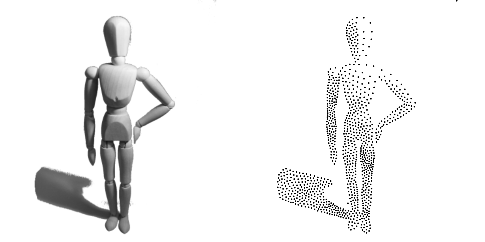
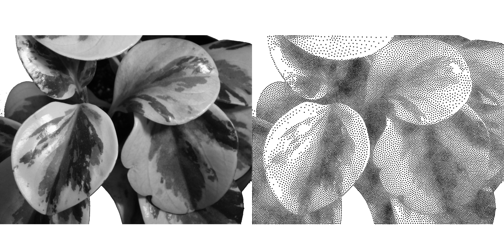

# Introduction

Adrian Secord introduces in [@Secord:2002] a *techniques for generating stipple
drawings from grayscale images using weighted centroidal Voronoi diagrams* as
in *the traditional artistic technique of stippling that places small dots of
ink onto paper such that their density give the impression of tone*. The paper
is not accompanied by any code and, even though
the [webpage](http://www.mrl.nyu.edu/~ajsecord/stipples.html) of the author
points to a code archive, this one is actually nowhere to be found. We decided
to replicate the method because it can be used for different purpose, especially
in computational biology or neuroscience where the distribution of a cell
population can be conveniently described by shades of grey. It is to be noted
that since the publication of this paper, a number of related techniques have
been
proposed [@AscencioLopez:2010][@Balzer:2009a][@Balzer:2009b][@Bridson:2007]
that may be more efficient but with lower quality. We thus privileged this
implementation that is simple and provides high stippling quality.

# Methods

We applied the method proposed in the original paper with some variations.
First, we did not use the GPU to generate the Voronoi diagram because this
would introduce a dependency on OpenGL that would make the script more fragile
and more difficult to run on all systems (Linux/OSX/Windows). However, we
provide in the accompanying code an experimental implementation based on
the [glumpy](http://glumpy.github.io) library. As in the original article, this
experimental implementation takes advantage of the fact that a set of cones
seen from above using an orthographic projection actually represents a Voronoi
diagram (see [@Hoff:1999]). This also gives "for free" a rasterization of each
Voronoi region provided each cone has a distinct color.

Consequently, for all the figures in this article, we used instead
the [QHull](http://www.qhull.org) library (through
the [Scipy](https://scipy.github.io) Python package) for computing the Voronoi
diagram together with the Voronoi regions (as a list of segments). We took care
of adding extra points such that each cell is contained within a user-defined
bounding box that is set to the dimension of the density image. Furthermore,
each input image is resized (without interpolation) such that the mean pixel
size of a voronoi cell is 500 (e.g. for 1000 stipples, the input image needs to
be resized such it contains at least 500x1000 pixels).

For computing the weighted centroid, we applied the definition proposed in the
original paper over the discrete representation of the domain:

$${\bf C}_i = \frac{\int_A {\bf x}\rho({\bf x})dA}{\int_A \rho({\bf x})}$$

Each cell is rasterized (as a set of pixels) and the centroid is computed using
the optimization proposed by the author that allow to avoid to compute the
integrals over the whole set of pixels composing the Voronoi cell. As noted by
the author, the precision of the method is directly related to the size of the
Voronoi cell. Consequently, if the original density image is too small
relatively to the number of stipples, there might be quality issues. We used a
fixed number of iterations ($n=50$) instead of using the difference in the
standard deviation of the area of the Voronoi regions as in the original paper
since the definition of the rejection criterion was not clear in the original
article and quite arbitrary.

Last, we added a threshold parameter that allows to perform a pre-processing of
the density image. Any pixel with a gray level above the threshold is set to the
threshold value before normalizing the density image. This was necessary for
replicating some of the original images (see results section for further
explanation).

# Results

We display only the output of our replication to be compared with the ones in
the original articles. The climbing shoe (figure @fig:shoe), the corn plant
(figure @fig:corn) and the large Peperomia plants (figure @fig:large-plant) are
very similar to the images displayed in the original article. It is to be noted
that we used different thresholds in order to obtain white areas similmar to
the original images. Without such threshold there would be no reason to have
white areas as for example in the leaves of figure @fig:large-plant.

For the small Peperomia (figure @fig:small-plant), the output of our
replication is less similar. If the hard edges are maintained by the stipple
drawing, the differences in shading in our replication is not obvious compared
to the original image. Most probably, the limited resolution of the input image
may be a limiting factor but it is not clear if the author used these small
resolution versions or if he used higher resolutions. We tested this hypothesis
using a bigger image showing leaf with different shading (figure @fig:leafs)
and in such a case, shading is visible in the output.

{#fig:shoe}

{#fig:corn}

{#fig:large-plant}

{#fig:small-plant}

{#fig:figure}

{#fig:leaves}

We also provide a new set of data that is freely usable for future comparison
(CC0 licence).

{#fig:boots}

{#fig:pot-plant}

{#fig:leafs}

# Conclusion

Most of the results have been replicated even though some slight discrepancies
remain in the final output for one image. It is difficult to identify the
precise cause but most likely, the problem occurs because of the limited
resolution of the input picture. We therefore think most of the results have
been replicated.

# References
