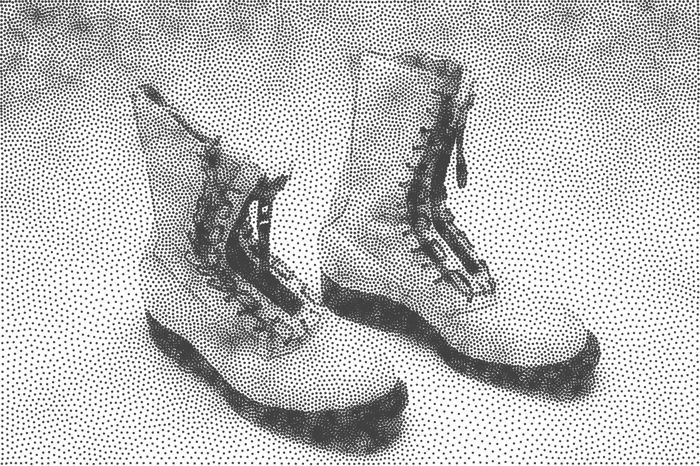

# Weighted Voronoi Stippling



This is a replication of the following article:

*Weighted Voronoi Stippling*, Adrian Secord. In: Proceedings of the 2nd
International Symposium on Non-photorealistic Animation and
Rendering. NPAR ’02. ACM, 2002, pp. 37– 43.

where the author introduced a *techniques for generating stipple drawings from
grayscale images using weighted centroidal Voronoi diagrams* as in *the
traditional artistic technique of stippling that places small dots of ink onto
paper such that their density give the impression of tone*.


## Pre-requisites

This replication has been written and tested on OSX 10.12 (Sierra) using the
following packages:

 * Python 3.6.0
 * Numpy 1.12.0
 * Scipy 0.18.1
 * Matplotlib 2.0.0
 * tqdm 4.10
 
Original data is in the data directory and you can also obtain it from
[Adrian Secord homepage](http://cs.nyu.edu/~ajsecord/npar2002/StipplingOriginals.zip).

## Usage

```
 usage: stippler.py [--n_iter n] [--n_point n] [--save] [--force]
                    [--pointsize min,max] [--figsize w,h]
                    [--display] [--interactive] file

 Weighted Vororonoi Stippler

 positional arguments:
   file                  Density image filename

 optional arguments:
   -h, --help            show this help message and exit
   --n_iter n            Maximum number of iterations
   --n_point n           Number of points
   --pointsize (min,max) (min,max)
                         Point mix/max size for final display
   --figsize w,h         Figure size
   --force               Force recomputation
   --save                Save computed points
   --display             Display final result
   --interactive         Display intermediate results (slower)
```
